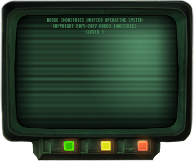

# 🎬 SDDM Video Background

Un script Bash qui installe un thème SDDM affichant une **vidéo en boucle en arrière-plan** sur votre écran de connexion. Compatible Qt5 et Qt6, testé sur Arch Linux, Debian, Ubuntu, Fedora et openSUSE.



---

## ✨ Fonctionnalités

- **Vidéo de fond en boucle** — MP4, WebM, AVI, MKV, MOV, GIF
- **Vidéo par défaut incluse** — `default.mp4` téléchargée automatiquement depuis ce dépôt si aucune vidéo n'est choisie
- **Interface SDDM complète** — choix de session, disposition clavier, boutons Login / Reboot / Power
- **Compatibilité Qt5 et Qt6** — détection automatique du greeter installé
- **Compatible Wayland et X11** — pas de `DisplayServer` forcé, SDDM choisit automatiquement
- **Vidéo facilement modifiable** — via `--change-video` ou en éditant un seul fichier
- **Vérification des dépendances** — bloc pre-flight qui détecte les problèmes avant de toucher au système
- **Installation automatique de GStreamer** — backend de décodage nécessaire pour la lecture vidéo sous Qt

---

## 📋 Prérequis

| Élément | Requis |
|---|---|
| `bash` 4.0+ | ✅ Obligatoire |
| `curl` ou `wget` | ✅ Obligatoire (téléchargement des assets) |
| `apt` / `pacman` / `dnf` / `zypper` | ✅ Un des quatre |
| `systemd` | ⚠️ Recommandé (activation SDDM automatique) |
| `kdialog` / `zenity` / `yad` | ⚠️ Optionnel (sélecteur graphique de vidéo) |

---

## 🚀 Installation

```bash
# Cloner le dépôt
git clone https://github.com/PapaOursPolaire/SDDM-video.git
cd SDDM-video

# Lancer le script en root
sudo bash sddm-video.sh
```

Le script va :
1. Vérifier les dépendances système en amont (**pre-flight**)
2. Installer SDDM si absent
3. Détecter automatiquement Qt5 ou Qt6
4. Installer les modules QtMultimedia et les plugins **GStreamer** (décodage H.264, WebM…)
5. Ouvrir un sélecteur de fichier graphique pour choisir votre vidéo
   - Si vous **annulez ou laissez vide** → `default.mp4` est téléchargée et utilisée automatiquement
6. Créer le thème dans `/usr/share/sddm/themes/sddm-video/`
7. Écrire la configuration dans `/etc/sddm.conf.d/sddm-video.conf`
8. Activer le service SDDM au démarrage

---

## 🎥 Changer la vidéo après installation

**Option 1 — Via le script (recommandé) :**
```bash
sudo bash sddm-video.sh --change-video
```
Ouvre le sélecteur graphique, copie la vidéo, met à jour la config, propose un redémarrage de SDDM.

**Option 2 — Manuellement :**
```bash
# Copiez votre vidéo dans le dossier du thème
sudo cp /chemin/vers/mavideo.mp4 /usr/share/sddm/themes/sddm-video/

# Éditez theme.conf
sudo nano /usr/share/sddm/themes/sddm-video/theme.conf
# → modifiez la ligne : background=mavideo.mp4

# Redémarrez SDDM
sudo systemctl restart sddm
```

---

## 🧪 Tester le thème sans redémarrer

```bash
# Qt6
sddm-greeter-qt6 --test-mode --theme /usr/share/sddm/themes/sddm-video

# Qt5
sddm-greeter --test-mode --theme /usr/share/sddm/themes/sddm-video
```

---

## 📁 Structure du thème installé

```
/usr/share/sddm/themes/sddm-video/
├── Main.qml            ← Interface QML (Qt5 ou Qt6 selon détection)
├── theme.conf          ← background=nomdevideo.mp4
├── theme.conf.user     ← Surcharges utilisateur (prioritaires sur theme.conf)
├── metadata.desktop    ← Métadonnées du thème
├── loginterminalc.png  ← Image de fond du panneau de connexion
├── angle-down.png      ← Icône des menus déroulants (session, clavier)
└── votre-video.mp4     ← Votre vidéo de fond
```

---

## 🔧 Dépendances installées automatiquement

Le script installe les paquets suivants selon votre distribution :

### Debian / Ubuntu
| Paquet | Rôle |
|---|---|
| `sddm` | Display manager |
| `qml6-module-qtmultimedia` | Modules QML pour la vidéo (Qt6) |
| `qml-module-qtmultimedia` | Modules QML pour la vidéo (Qt5) |
| `gstreamer1.0-plugins-good` | Décodeurs WebM, VP8/VP9… |
| `gstreamer1.0-plugins-bad` | Décodeurs supplémentaires |
| `gstreamer1.0-plugins-ugly` | H.264, MP3… |
| `gstreamer1.0-libav` | Codec ffmpeg (MP4 H.264/H.265) |

### Arch Linux
| Paquet | Rôle |
|---|---|
| `sddm` | Display manager |
| `qt6-multimedia` | Backend Qt6 multimedia |
| `gst-libav` | Codec ffmpeg |
| `gst-plugins-good/bad/ugly` | Décodeurs complets |

### Fedora / RHEL
| Paquet | Rôle |
|---|---|
| `sddm` | Display manager |
| `qt6-qtmultimedia` | Backend Qt6 multimedia |
| `gstreamer1-plugins-good` | Décodeurs de base |
| `gstreamer1-libav` | Codec ffmpeg |

### openSUSE
| Paquet | Rôle |
|---|---|
| `sddm` | Display manager |
| `libQt6Multimedia6` | Backend Qt6 multimedia |
| `gstreamer-plugins-good/bad/libav` | Décodeurs complets |

---

## ⚙️ Formats vidéo supportés

| Format | Extension | Notes |
|---|---|---|
| MPEG-4 | `.mp4` | Recommandé — meilleure compatibilité |
| WebM | `.webm` | Bon choix open-source |
| Matroska | `.mkv` | Selon les codecs installés |
| AVI | `.avi` | Support variable |
| QuickTime | `.mov` | Support variable |
| GIF animé | `.gif` | Fonctionne mais moins fluide |

> **Conseil :** Utilisez un `.mp4` encodé en H.264 pour la meilleure compatibilité avec QtMultimedia et GStreamer.

---

## ❓ Dépannage

### Écran noir au démarrage de SDDM
```bash
# Vérifier les logs SDDM
journalctl -u sddm -b --no-pager

# Tester le thème en mode test
sddm-greeter-qt6 --test-mode --theme /usr/share/sddm/themes/sddm-video
```

### La vidéo ne s'affiche pas (fond noir)
GStreamer n'est peut-être pas correctement installé. Vérifiez :
```bash
# Tester si GStreamer peut lire votre fichier
gst-launch-1.0 playbin uri=file:///usr/share/sddm/themes/sddm-video/votre-video.mp4

# Réinstaller les plugins si nécessaire (Debian/Ubuntu)
sudo apt-get install --reinstall gstreamer1.0-plugins-good gstreamer1.0-libav
```

### Erreur "module QtMultimedia is not installed"
```bash
# Qt6 — Debian/Ubuntu
sudo apt-get install qml6-module-qtmultimedia

# Qt5 — Debian/Ubuntu
sudo apt-get install qml-module-qtmultimedia

# Arch
sudo pacman -S qt6-multimedia
```

### SDDM démarre mais n'utilise pas le bon thème
```bash
# Vérifier la config active
cat /etc/sddm.conf.d/sddm-video.conf

# S'assurer qu'il n'y a pas de conflit avec /etc/sddm.conf
ls -la /etc/sddm.conf 2>/dev/null && echo "Fichier conflictuel présent !" || echo "OK"
```

---

## 📜 Licence

GPL — voir [LICENSE](LICENSE)

---

*by [PapaOursPolaire](https://github.com/PapaOursPolaire)*
